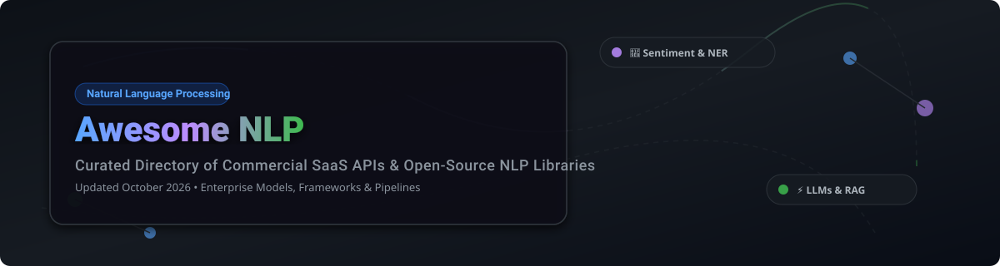

<!-- SEO Metadata
  Title: Awesome Natural Language Processing (NLP) - Top SaaS APIs & Open Source Libraries
  Description: A comprehensive, curated directory of Natural Language Processing (NLP) tools, SaaS APIs, LLM frameworks, text analytics platforms, and open-source GitHub repositories.
  Keywords: NLP, Natural Language Processing, Sentiment Analysis, Named Entity Recognition, NER, LLMs, RAG, Transformers, Text Analytics, spaCy, HuggingFace, NLTK, OpenAI, Cohere
-->

# 🧠 Awesome Natural Language Processing (NLP)

  

  
  
  
  
  
  

---

## 📌 Top Natural Language Processing (NLP) Ecosystem

A curated, production-oriented index of **Commercial SaaS NLP Platforms** and **Open-Source GitHub Libraries** designed to process, analyze, and generate human language — spanning text classification, sentiment analysis, named entity recognition (NER), topic modeling, retrieval-augmented generation (RAG), and Large Language Model (LLM) orchestration.

---

## 📑 Table of Contents
- [📈 Sector Market Overview](#-sector-market-overview)
- [🏢 SaaS & Hosted Commercial Platforms](#-saas--hosted-commercial-platforms)
- [⚡ Open-Source GitHub Projects](#-open-source-github-projects)
- [💡 Key NLP Categories & Use Cases](#-key-nlp-categories--use-cases)
- [❓ Frequently Asked Questions (FAQ)](#-frequently-asked-questions-faq)
- [🤝 How to Contribute](#-how-to-contribute)
- [⚠️ Disclaimer & Best Practices](#%EF%B8%8F-disclaimer--best-practices)
- [💖 Support & Community](#-support--community)
- [⭐ Star History](#-star-history)

---

## 📈 Sector Market Overview

> 📊 **Market Estimate**: The global Natural Language Processing (NLP) market is estimated at **$25.7 Billion in 2024** and is projected to expand to **$161.4 Billion by 2032**, compounding at a **CAGR of 25.8%**.
> 
> 🌐 **Market Structure**: The NLP sector is **moderately fragmented**. Cloud hyperscalers (Microsoft Azure, Google Cloud, AWS) dominate scalable infrastructure, while specialized LLM pioneers (OpenAI, Cohere) and model hubs (Hugging Face) capture advanced generative workloads, and domain-focused vendors address niche enterprise compliance and multilingual analytics.

---

## 🏢 SaaS & Hosted Commercial Platforms

The table below catalogs leading commercial NLP APIs sorted by **Company Size / Valuation** (descending).

| SaaS / Commercial Platform 🏢 | Company Size / Valuation / Scale 💰 | Starting Tier Pricing 💵 | Free Tier Limit / Free Trial 🎁 | Core Specialization 🎯 |
| :--- | :--- | :--- | :--- | :--- |
| **[Azure AI Language](https://azure.microsoft.com/en-us/products/ai-services/ai-language)** | ~$3.10 Trillion *(Microsoft Market Cap)* | $1.00 per 1,000 text records | 5,000 text records/mo free forever | Enterprise Microsoft cloud NLP, entity extraction & summarization |
| **[Google Cloud Natural Language API](https://cloud.google.com/natural-language)** | ~$2.20 Trillion *(Alphabet Market Cap)* | $1.00 per 1,000 text units | 5,000 units/mo free forever | GCP-native entity analysis, sentiment, and syntax parsing |
| **[Amazon Comprehend](https://aws.amazon.com/comprehend/)** | ~$1.90 Trillion *(Amazon Market Cap)* | $0.0001 per unit (100 chars) | 50,000 units/mo free for 12 months | AWS-native custom classification and sentiment analytics |
| **[OpenAI API](https://openai.com/)** | ~$157.0 Billion *(Private Valuation)* | $0.0015 / 1k input tokens (GPT-4o mini) | $5.00 free API credits on sign-up (3-mo validity) | Leading LLMs (GPT-4o), embeddings & fine-tuning |
| **[Cohere Platform](https://cohere.com/)** | ~$5.50 Billion *(Private Valuation)* | $0.00015 / 1k tokens (Embed v3) | 1,000 free API requests/month (Trial API Key) | Enterprise generative NLP, reranking & text embeddings |
| **[Hugging Face Inference API](https://huggingface.co/inference-api)** | ~$4.50 Billion *(Private Valuation)* | $9.00 / month (PRO Tier) | Free community rate-limited tier (1,000 req/hr) | Hosted inference across 500,000+ open transformer models |
| **[Rosette API](https://www.rosette.com/)** | ~$300.0 Million *(Veritas Capital PE)* | $250.00 / month (Developer Tier) | 14-day free trial (up to 10,000 API calls) | Enterprise multilingual entity resolution & morphology |
| **[Expert.ai](https://www.expert.ai/)** | ~$100.0 Million *(Euronext Market Cap)* | $49.00 / month (Starter Tier) | 14-day free trial (up to 10,000 API calls) | Hybrid symbolic AI & deep learning for domain text analytics |
| **[MonkeyLearn](https://monkeylearn.com/)** | ~$15.0 Million *(Acquired by Medallia)* | $299.00 / month (Team Plan) | 14-day free trial (up to 300 test queries) | No-code sentiment analysis and ticket classification |
| **[spaCy Universe Cloud](https://spacy.io/universe)** | ~$10.0 Million *(Explosion AI)* | $20.00 / month (Hosted Base) | Free community tier for open model demos | Cloud hosting for custom spaCy pipelines & models |

---

## ⚡ Open-Source GitHub Projects

The table below highlights top open-source NLP libraries, frameworks, and engines sorted by **GitHub_Stars** (descending).

| Repository & Link 📦 | GitHub Stars_Badge ⭐ | License 📜 | Description & Primary Use Case 🛠️ |
| :--- | :--- | :--- | :--- |
| **[Ollama](https://github.com/ollama/ollama)** |  | MIT | Local LLM runner and orchestration engine for Llama 3, Mistral, and custom GGUF models. |
| **[Hugging Face Transformers](https://github.com/huggingface/transformers)** |  | Apache-2.0 | De facto standard repository for state-of-the-art pre-trained Transformer architectures (PyTorch/TF/JAX). |
| **[LangChain](https://github.com/langchain-ai/langchain)** |  | MIT | Modular framework for building LLM applications, chains, autonomous agents, and RAG architectures. |
| **[vLLM](https://github.com/vllm-project/vllm)** |  | Apache-2.0 | High-throughput and memory-efficient LLM serving engine featuring PagedAttention. |
| **[LlamaIndex](https://github.com/run-llama/llama_index)** |  | MIT | Data framework for connecting custom enterprise data sources to LLMs for advanced RAG indexing. |
| **[Google BERT](https://github.com/google-research/bert)** |  | Apache-2.0 | Groundbreaking bidirectional transformer pre-training representation for language understanding. |
| **[spaCy](https://github.com/explosion/spaCy)** |  | MIT | Industrial-strength NLP library in Python featuring fast NER, POS tagging, and transformer integration. |
| **[Haystack](https://github.com/deepset-ai/haystack)** |  | Apache-2.0 | End-to-end open-source NLP orchestration framework for production RAG and semantic search. |
| **[fastText](https://github.com/facebookresearch/fastText)** |  | MIT | Meta AI's efficient subword text classification and word representation vector engine. |
| **[Sentence Transformers](https://github.com/UKPLab/sentence-transformers)** |  | Apache-2.0 | Compute dense sentence, document, and image embeddings using BERT/RoBERTa architectures. |
| **[Gensim](https://github.com/piskvorky/gensim)** |  | LGPL-2.1 | Efficient topic modeling, document similarity, and Word2Vec/Doc2Vec vector space modeling. |
| **[RAGAS](https://github.com/explodinggradients/ragas)** |  | Apache-2.0 | Evaluation framework for Retrieval Augmented Generation pipelines (faithfulness, context precision). |
| **[NLTK](https://github.com/nltk/nltk)** |  | Apache-2.0 | The foundational Natural Language Toolkit for Python, widely used in research and education. |
| **[Flair](https://github.com/flairNLP/flair)** |  | MIT | SOTA contextual string embedding framework for named entity recognition (NER) and POS tagging. |
| **[AllenNLP](https://github.com/allenai/allennlp)** |  | Apache-2.0 | PyTorch-based NLP research library developed by the Allen Institute for AI. |
| **[Stanford CoreNLP](https://github.com/stanfordnlp/CoreNLP)** |  | GPL-2.0 | Java-based suite of linguistic analysis tools providing robust sentence structure and entity parsing. |
| **[TextBlob](https://github.com/sloria/TextBlob)** |  | MIT | Simple, intuitive Python API for common NLP tasks like sentiment analysis, noun-phrase extraction, and translation. |
| **[Stanza](https://github.com/stanfordnlp/stanza)** |  | Apache-2.0 | Stanford's official Python NLP package offering accurate neural pipeline processing for 70+ human languages. |
| **[textacy](https://github.com/chartbeat-labs/textacy)** |  | Apache-2.0 | Python library built on top of spaCy to perform higher-level NLP tasks, preprocessing, and statistics. |
| **[Apache OpenNLP](https://github.com/apache/opennlp)** |  | Apache-2.0 | Machine-learning-based toolkit for processing natural language text written in Java. |

---

## 💡 Key NLP Categories & Use Cases

- **🔍 Named Entity Recognition (NER)**: Extracting entities (person, organization, location, dates) via `spaCy`, `Stanza`, or `Rosette API`.
- **📊 Sentiment Analysis & Opinion Mining**: Customer feedback analysis using `TextBlob`, `MonkeyLearn`, or `Amazon Comprehend`.
- **🤖 Large Language Model (LLM) Orchestration**: Autonomous agent pipelines using `LangChain`, `LlamaIndex`, or `Ollama`.
- **⚡ High-Throughput Inference**: Serving open-weights LLMs in production using `vLLM` or `Hugging Face Inference API`.
- **🧠 Semantic Search & Vector Embeddings**: Generating dense vector representations using `Sentence Transformers` or `Cohere`.

---

## ❓ Frequently Asked Questions (FAQ)

<b>1. Should I choose a Commercial SaaS API or an Open-Source Library?</b>

 
Choose <b>Commercial SaaS APIs</b> (OpenAI, Azure, Google Cloud) if you require zero infrastructure maintenance, fast prototyping, enterprise SLAs, and state-of-the-art general intelligence. Choose <b>Open-Source Libraries</b> (spaCy, Transformers, vLLM) if you require full data sovereignty, custom model fine-tuning, zero API per-call costs, or offline edge deployment.

<b>2. Which library is best for production tokenization and NER?</b>

 
<b>spaCy</b> is widely regarded as the industry standard for production CPU/GPU NLP pipelines due to its speed, Cython optimizations, and robust API design.

<b>3. How do I evaluate my RAG application?</b>

 
You can use evaluation frameworks like <b>RAGAS</b> to measure context precision, context recall, faithfulness, and answer relevance.

---

## 🤝 How to Contribute

Contributions are welcome! Please follow these simple guidelines:

1. Fork the repository.
2. Add your entry into the appropriate table adhering to the established sorting rules (SaaS by Valuation, Open-Source by GitHub_Stars).
3. Ensure exact pricing/free tier details or Stars_Badge links (`/stargazers`) are included.
4. Submit a Pull Request with a short summary of changes.

---

## ⚠️ Disclaimer & Best Practices

- **Data Privacy & Governance**: Commercial SaaS APIs process text on remote vendor servers. Verify compliance requirements (GDPR, HIPAA, SOC2) before streaming sensitive data.
- **Model Biases**: Pre-trained models inherit historical web data biases. Conduct fairness and safety evaluations prior to critical production deployment.
- **Licenses**: Open-source framework licenses (MIT, Apache-2.0, LGPL) vary. Always check individual model weights licenses when downloading from Hugging Face Hub.

---

## 💖 Support & Community

Thank you for exploring the Natural Language Processing ecosystem! If you find this directory helpful for your projects, research, or work:

- ⭐ **Star** this repository to show your support!
- 🍴 **Fork** it to keep a personal reference or contribute updates.
- 📢 **Share** it with fellow AI engineers, data scientists, and researchers.
- ☕ **Sponsor**: Support ongoing updates and maintenance via [GitHub Sponsors](https://github.com/sponsors/ishandutta2007).

---

## ⭐ Star History

---

  <b>Maintained for NLP Engineers, Data Scientists, and Enterprise AI Architects.</b> 
  Made with ❤️ for the Open-Source AI Community.

